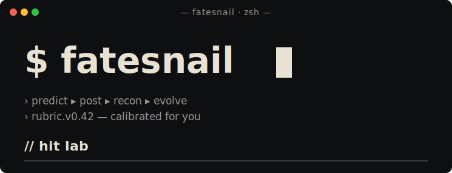

<h1 align="center">
  
</h1>

<h2 align="center">Hit Lab</h2>

<p align="center">
  <strong>English</strong>
  &nbsp;·&nbsp;
  <a href="docs/README_CN.md"><strong>简体中文</strong></a>
</p>

<p align="center">
<a href="CHANGELOG.md"></a>
&nbsp;
<a href="LICENSE"></a>
</p>

<p align="center">
For content creators — a skill that turns every post into a calibrated experiment.
</p>

<p align="center">
You're reading this. The skill predicted it.<br>
It turns every "I feel this will go viral" into a calibrated experiment.<br>
Your doubt — predicted too.
</p>

---

## 🎬 What it actually does

Most creators live in the same gambling loop:

> Publish → Numbers come in → Learn nothing → Roll the dice again

A creator who's shipped 200 pieces is barely 10% sharper than someone who's shipped 1 — because they never **kept books** after each round.

**Hit Lab** makes every judgment get logged, retrospected, absorbed into the next:

📊 Score → 🎯 Blind-predict → 🚀 Publish → 📈 T+3d retro → 🧬 Evolve your rubric

This isn't motivation. It's **compounding** — every piece you don't retro is silently eroding your ability to see yourself.

One month in = you have a hit-formula that's **only yours**.
Three months in = you're 10× sharper than your first-day self.

---

## ⚖️ How it differs from other "creator tools"

| Others | This |
|---|---|
| Give you "inspiration" | Make **your own intuition** measurable |
| AI writes for you | AI **judges** for you — the script stays yours |
| Ship 10 versions, A/B test | Ship one — **bet** in writing, settle the books with data |
| Static dashboard | An **evolving rubric** — your formula 3 months from now isn't the starting one |

In a sentence: other tools help you "ship more." This helps you "judge sharper."

---

## 🤔 Can't I just use ChatGPT / DeepSeek / Doubao?

Those are **general assistants** — they tell everyone the same thing. You ask "will this go viral?" and the answer is fitted to global average opinion, not your channel. Ask again tomorrow — same answer. **It doesn't remember you. It doesn't change because of you.**

This is **your own ops expert** — serving only your one channel:

- The scoring formula is reverse-engineered from **your** history, not the global training distribution
- Every piece you ship updates its understanding — by month three, judgment accuracy is 10× sharper than day one (**auto-evolving**)
- It knows your benchmark account, your cadence, the last three reasons you flopped — things ChatGPT forgets after the first reply

General LLMs help everyone. This helps **your** account.

---

## 🛡️ Why the loop actually evolves

📝 **Every piece is logged**: Score and prediction get written before publish, archived end-to-end. Three days later you settle accounts — you see exactly where you were sharp, where you were off. No more vague "I feel this one didn't land."

🔁 **It gets sharper**: Three same-direction misses in a row, the tool actively prompts you to upgrade your scoring formula. **You don't have to remember — it remembers for you.**

🛡️ **Upgrades have a brake**: Switching the formula requires re-scoring all historical samples — only released if it ranks more accurately than the old. Plus a cross-model independent audit — **so you can't fool yourself.**

🪒 **The rubric is a workbench, not a museum**: Observations refuted by data get deleted; observations absorbed into formal dimensions also get deleted. It only holds what's most useful right now.

---

## 📦 Install

```bash
git clone https://github.com/XBuilderLAB/hit-lab.git
cd hit-lab
bash install.sh
```

> ⚠️ **Upgrading from v0.x?** Run `/hit-migrate` in your content project after `git pull`. The 1.3 → 1.4 migration is **BREAKING for blind-channel integrity** — it splits `rubric_notes.md` so the blind sub-agent can't leak actuals. Without migrate, blind scoring will keep flagging `non_blind_warning`. See [CHANGELOG](CHANGELOG.md) and [migrations/1.3-to-1.4.md](migrations/1.3-to-1.4.md).

14 sub-skills are symlinked into your agent's skill directory. One install, every content project gets it.

**Supported agents**: Claude Code (default) · Codex (`bash install.sh --codex`) · Both (`bash install.sh --all`)

> Frozen version: `bash install.sh --copy` / `bash install.sh --codex --copy`
>
> Uninstall: `bash uninstall.sh` / `bash uninstall.sh --codex` (your content data is not touched)

---

## 🚀 First run

In your content project directory, open a skill-compatible agent and say:

```
初始化 hit-lab
```

(or `init hit-lab`)

Five yes/no questions complete onboarding. **Strongly recommend importing a benchmark account** — 5–10 samples and the tool gets an anchor immediately. Without one, your first 5 predictions land at ±50% precision.

Two built-in starter rubrics: **opinion video** and **tutorial / list-style posts** (the latter exists because we measured a 9× rank inversion when grading tutorial content with the opinion rubric — actionability and collect-rate, not emotion, drive that form). Other forms start from either and evolve via `bump rubric`.

Already published before installing? Say `backfill` — past posts get registered as retro-only records (no fabricated predictions), so your calibration pipeline starts with real data instead of an empty queue.

---

## ⚡ Daily use

```
score this scripts/<...>.md       → grade only
start prediction scripts/<...>.md → blind prediction + decision log
shot scripts/<...>.md             → create video folder + buffer +1
preflight                          → pre-publish lint: title artifacts / char limit / image count
shipped https://...                → buffer -1
backfill                           → register posts published before hit-lab (retro-only)
retro videos/<...>/                → T+3d data + retrospective
status / fetch trends / find topic / bump rubric / find benchmark
```

Hook-aware agents auto-report buffer + pending retros + top candidates at every session start — no need to ask. Other agents: just say `status`.

Full workflow + sub-skill details: see [SKILL.md](SKILL.md).

---

## 📈 Star History

<a href="https://star-history.com/#XBuilderLAB/hit-lab&Date">
  
</a>

---

## 📜 License

MIT. Commercial use, modification, closed-source integration — all fine.

---

*The future doesn't reward effort — it rewards those who see the pattern first.*

*You reading this line — that's predicted too.*
